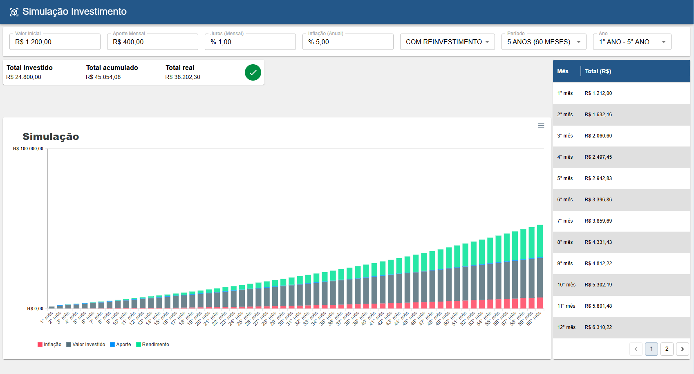

# Simulador de Investimento

## Introdução

Este projeto simula a evolução de um investimento com base em parâmetros fornecidos pelo usuário, como o valor aplicado, a taxa de rendimento e a inflação estimada. A aplicação exibe, por meio de um gráfico de barras, a comparação entre o valor investido, o rendimento acumulado e o impacto da inflação ao longo do tempo. Também apresenta totalizadores que resumem os principais indicadores da simulação.

Utilizando conceitos de Ciência de Dados, esta dashboard transforma dados brutos em representações visuais claras, facilitando o entendimento da projeção do investimento ao longo dos períodos definidos.



---

## 🧠 Tecnologias e Abordagem

- **Cálculos Matemáticos Complexos**: Implementa algoritmos com operações aritméticas intensivas, incluindo funções exponenciais para simular a evolução de investimentos com precisão.
- **Service Workers**: Executa processamento pesado fora do núcleo principal da aplicação React, de forma assíncrona, melhorando a performance e a experiência do usuário.
- **MUI**: Utilizado para a construção da interface, com abstração de complexos complexos, como DataGrid com paginação.
- **ApexCharts**: Biblioteca de gráficos baseada em SVG, responsável pela renderização dos gráficos de barras. Embora não seja a mais otimizada em performance, oferece boa personalização e visualização clara.
- **React, Javascript e Typescript**: Estrutura do projeto

---

## 🚀 Principais pontos do Projeto

- **Modelagem Matemática de Investimentos**
- **Processamento Otimizado com React e Service Workers**

---

## 📁 Estrutura Sugerida (Opcional)

```bash
├───public
│   └───workers
├───README.md
└───src
    ├───assets
    ├───components
    │   ├───Header
    │   │   └───AppBar
    │   └───Loading
    ├───layout
    ├───pages
    │   └───Simulador
    │       ├───contexts
    │       │   ├───formularioContext
    │       │   └───simulacaoContext
    │       ├───DataGridSimulacao
    │       │   └───CustomDataGrid
    │       │       └───CustomPaginationDataGrid
    │       ├───GraficoSimulacao
    │       ├───FormularioSimulacao
    │       ├───HeaderTotalizador
    │       └───hooks
    │           └───useWorkerSimulador
    ├───themes
    └───utils
```

---

## 🌐 *Por que useRef e Worker?*
O uso de **Web Workers** é essencial neste projeto devido à alta carga computacional gerada por cálculos exponenciais — operações aritméticas intensas que, se executadas na thread principal, podem comprometer significativamente a performance da aplicação. Ao delegar esse processamento a um worker, evitamos sobrecarregar o núcleo principal do React, mantendo a interface fluida e responsiva.

A comunicação com o worker é gerenciada de forma **assíncrona** dentro de um **hook**, utilizando uma Promise para encapsular o processo. Isso garante que a **thread principal** permaneça **livre** para atualizar a UI e lidar com outras tarefas, otimizando a experiência do usuário.

Já o **useRef** é utilizado para armazenar grandes volumes de dados — como os milhares de valores do gráfico — **sem provocar re-renderizações desnecessárias**. Ao contrário do useState, ele permite a mutação dos dados sem impactar a renderização da interface, o que é crucial para manter a **performance** em cenários com alto volume de informação. Além disso, useRef preserva a mesma referência do objeto entre renderizações, garantindo consistência e eficiência no acesso aos dados.

### 🧱 **Exemplo prático no projeto:**
```js
  // hooks/useWorkerSimulador

export function useWorkerSimulador() {
  // useRef para armazenamento das listas de valores (inflação, valor investido, rendimento, aporte)
  const resultadosRef = useRef<TDadosResultadosSimulacao | null>(null)

  // useState que funciona como um observador
  const [resultadoDisponivel, setResultadoDisponivel] = useState(false)

  // carregando a Promise
  const [carregando, setCarregando] = useState(false)

  // em caso de Erro na Promise
  const [erro, setErro] = useState<ErrorEvent | null>(null)

  const simular = useCallback((form: TDadosFormularioSimulador) => {
    return new Promise((resolve, reject) => {
      setCarregando(true)
      setErro(null)

      const worker = new Worker('workers/simulacao.worker.js', {
        type: 'module',
      })

      worker.onmessage = (e) => {
        resultadosRef.current = e.data
        setResultadoDisponivel(true)
        setCarregando(false)
        resolve(e.data)
        worker.terminate()
      }

      worker.onerror = (err) => {
        setErro(err)
        setCarregando(false)
        reject(err)
        worker.terminate()
      }

      worker.postMessage(form)
    })
  }, [])

  return {
    simular,
    resultadoDisponivel,
    getResultados: () => resultadosRef.current,
    carregando,
    erro,
  }
}
```
---

## 🚀 Inicializar
### Passo 1: Abrir o projeto
- Abra o projeto no terminal

### Passo 2: Instalar Dependências
- digite `npm instal` no terminal

### Passo 3: Inicializar
- digite `npm run dev` no terminal

### Passo 4: Acessar
- abra `localhost:3003` no navegador


## 🔗 **Links Úteis**
- [MUI](https://mui.com/)
- [ApexCharts](https://apexcharts.com/react-chart-demos/)
- [Web Worker](https://developer.mozilla.org/pt-BR/docs/Web/API/Web_Workers_API)
- [useRef](https://pt-br.react.dev/reference/react/useRef)